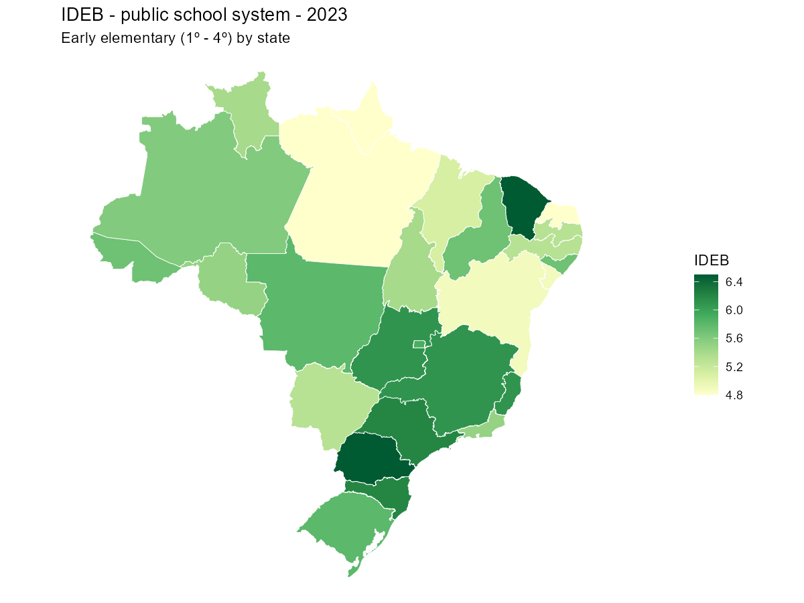

# educabR

<!-- badges: start -->
[](https://CRAN.R-project.org/package=educabR)
[](https://CRAN.R-project.org/package=educabR)
[](https://github.com/SidneyBissoli/educabR/actions/workflows/R-CMD-check.yaml)
[](https://app.codecov.io/gh/SidneyBissoli/educabR)
[](https://lifecycle.r-lib.org/articles/stages.html#stable)
<!-- badges: end -->

*[Leia em Português](https://github.com/SidneyBissoli/educabR/blob/main/README.pt-br.md)*

**educabR** gives you direct access to Brazil's main public education
datasets — from school census and national exams to university indicators
and education funding — all from within R. No manual downloads, no
navigating government portals: just pick a dataset, choose the year, and
get a clean, analysis-ready table.

The package covers 14 datasets published by INEP, FNDE, CAPES, and STN,
spanning basic education, higher education, graduate programs, and
FUNDEB funding.

## Quick example

Map IDEB scores across Brazilian states with just a few lines:

```r
# install package "pacman" if it is not installed
if (!require("pacman")) install.packages("pacman")

# install and/or load packages
p_load(
  educabR,
  geobr,
  tidyverse
)

# read ideb data
ideb <- get_ideb(
  level  = "estado", 
  stage  = "anos_iniciais", 
  metric = "indicador", 
  year   = 2023
  )

# read spatial data
states <- read_state(year = 2020, showProgress = FALSE)

# plot data
states |>
  left_join(ideb, by = c("abbrev_state" = "uf_sigla")) |>
  drop_na() |>
  filter(rede == "Pública" & indicador == "IDEB") |>
  ggplot() +
  geom_sf(aes(fill = valor), color = "white", size = .2) +
  scale_fill_distiller(palette = "YlGn", direction = 1, name = "IDEB") +
  labs(
    title    = "IDEB - public school system - 2023",
    subtitle = "Early elementary (1º - 4º) by state"
  ) +
  theme_void()
```



## Installation

Install from CRAN:

```r
install.packages("educabR")
```

Or install the development version from GitHub:

```r
# install.packages("remotes")
remotes::install_github("SidneyBissoli/educabR")
```

## Features

### Basic Education

| Dataset | Function | Available Years |
|---------|----------|-----------------|
| IDEB - Basic Education Development Index | `get_ideb()`, `get_ideb_series()` | 2017, 2019, 2021, 2023 |
| ENEM - National High School Exam | `get_enem()`, `get_enem_itens()` | 1998-2024 |
| School Census | `get_censo_escolar()` | 1995-2024 |
| SAEB - Basic Education Assessment System | `get_saeb()` | 2011-2023 (biennial) |
| ENCCEJA - Youth and Adult Certification Exam | `get_encceja()` | 2014-2024 |
| ENEM by School (discontinued) | `get_enem_escola()` | 2005-2015 |

### Higher Education

| Dataset | Function | Available Years |
|---------|----------|-----------------|
| Higher Education Census | `get_censo_superior()` | 2009-2024 |
| ENADE - National Student Performance Exam | `get_enade()` | 2004-2024 |
| IDD - Value-Added Indicator | `get_idd()` | 2014-2023 |
| CPC - Preliminary Course Concept | `get_cpc()` | 2007-2023 |
| IGC - General Courses Index | `get_igc()` | 2007-2023 |

### Graduate Education

| Dataset | Function | Available Years |
|---------|----------|-----------------|
| CAPES - Graduate programs, students, faculty | `get_capes()` | 2013-2024 |

### Education Funding

| Dataset | Function | Available Years |
|---------|----------|-----------------|
| FUNDEB - Resource distribution | `get_fundeb_distribution()` | 2007-2026 |
| FUNDEB - Enrollment counts | `get_fundeb_enrollment()` | 2007-2026 |

## Examples

### IDEB

```r
library(educabR)

# Download IDEB 2021 - Early elementary - Schools
ideb <- get_ideb(
  year  = 2021,
  stage = "anos_iniciais",
  level = "escola"
)

# Historical series
ideb_series <- get_ideb_series(
  years = c(2017, 2019, 2021, 2023),
  level = "municipio",
  stage = "anos_iniciais"
)
```

### ENEM

```r
# Download a sample for exploration
enem <- get_enem(year = 2023, n_max = 10000)

# Statistical summary
enem_summary(enem)

# Summary by sex
enem_summary(enem, by = "tp_sexo")
```

### School Census

```r
# Download School Census 2023 - filter by state
censo_sp <- get_censo_escolar(year = 2023, uf = "SP")
```

### Higher Education

```r
# Higher Education Census - institutions
ies <- get_censo_superior(2023, type = "ies")

# ENADE microdata
enade <- get_enade(2023, n_max = 10000)

# CAPES graduate programs
programas <- get_capes(2023, type = "programas")
```

### FUNDEB

```r
# Resource distribution by state
dist <- get_fundeb_distribution(2023, uf = "SP")

# Enrollment counts
mat <- get_fundeb_enrollment(2023, uf = "SP")
```

## Cache

The package uses local caching to avoid repeated downloads:

```r
# Set a permanent cache directory
set_cache_dir("~/educabR_data")

# List cached files
list_cache()

# Clear cache
clear_cache()
```

## Documentation

- [Package website](https://sidneybissoli.github.io/educabR/)
- [Getting started](https://sidneybissoli.github.io/educabR/articles/getting-started.html)
- [Basic education assessments](https://sidneybissoli.github.io/educabR/articles/basic-education-assessments.html)
- [Higher education](https://sidneybissoli.github.io/educabR/articles/higher-education.html)
- [Education funding](https://sidneybissoli.github.io/educabR/articles/education-funding.html)
- [Mapping education indicators with geobr](https://sidneybissoli.github.io/educabR/articles/mapping-education-with-geobr.html)

## License

MIT
