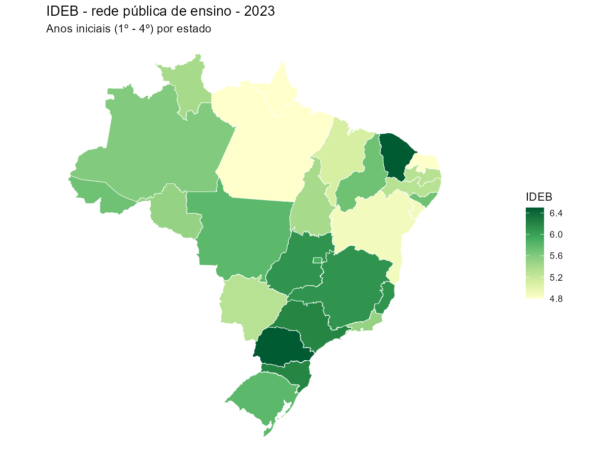

# educabR

<!-- badges: start -->
[](https://CRAN.R-project.org/package=educabR)
[](https://CRAN.R-project.org/package=educabR)
[](https://github.com/SidneyBissoli/educabR/actions/workflows/R-CMD-check.yaml)
[](https://app.codecov.io/gh/SidneyBissoli/educabR)
[](https://lifecycle.r-lib.org/articles/stages.html#stable)
<!-- badges: end -->

*[Read in English](README.md)*

O **educabR** dá acesso direto aos principais dados educacionais
públicos do Brasil — do censo escolar e exames nacionais a indicadores
universitários e financiamento da educação — tudo de dentro do R. Sem
downloads manuais, sem navegar portais do governo: basta escolher o
dataset, o ano, e receber uma tabela limpa, pronta para análise.

O pacote cobre 14 conjuntos de dados publicados pelo INEP, FNDE, CAPES
e STN, abrangendo educação básica, educação superior, pós-graduação e
financiamento via FUNDEB.

## Exemplo rápido

Mapa do IDEB por estado em poucas linhas:

```r
# instalar pacote "pacman" se não estiver instalado
if (!require("pacman")) install.packages("pacman")

# instalar e/ou carregar pacotes
p_load(
  educabR,
  geobr,
  tidyverse
)

# ler dados do IDEB
ideb <- get_ideb(
  level  = "estado", 
  stage  = "anos_iniciais", 
  metric = "indicador", 
  year   = 2023
  )

# ler dados espaciais
states <- read_state(year = 2020, showProgress = FALSE)

# plotar dados
states |>
  left_join(ideb, by = c("abbrev_state" = "uf_sigla")) |>
  drop_na() |>
  filter(rede == "Pública" & indicador == "IDEB") |>
  ggplot() +
  geom_sf(aes(fill = valor), color = "white", size = .2) +
  scale_fill_distiller(palette = "YlGn", direction = 1, name = "IDEB") +
  labs(
    title    = "IDEB - rede pública de ensino - 2023",
    subtitle = "Anos iniciais (1º - 4º) por estado"
  ) +
  theme_void()
```



## Instalação

Instale do CRAN:

```r
install.packages("educabR")
```

Ou instale a versão de desenvolvimento do GitHub:

```r
# install.packages("remotes")
remotes::install_github("SidneyBissoli/educabR")
```

## Funcionalidades

### Educação Básica

| Dataset | Função | Anos disponíveis |
|---------|--------|------------------|
| IDEB - Índice de Desenvolvimento da Educação Básica | `get_ideb()`, `get_ideb_series()` | 2017, 2019, 2021, 2023 |
| ENEM - Exame Nacional do Ensino Médio | `get_enem()`, `get_enem_itens()` | 1998-2024 |
| Censo Escolar | `get_censo_escolar()` | 1995-2024 |
| SAEB - Sistema de Avaliação da Educação Básica | `get_saeb()` | 2011-2023 (bienal) |
| ENCCEJA - Exame Nacional de Certificação de Jovens e Adultos | `get_encceja()` | 2014-2024 |
| ENEM por Escola (descontinuado) | `get_enem_escola()` | 2005-2015 |

### Educação Superior

| Dataset | Função | Anos disponíveis |
|---------|--------|------------------|
| Censo da Educação Superior | `get_censo_superior()` | 2009-2024 |
| ENADE - Exame Nacional de Desempenho dos Estudantes | `get_enade()` | 2004-2024 |
| IDD - Indicador de Diferença entre os Desempenhos | `get_idd()` | 2014-2023 |
| CPC - Conceito Preliminar de Curso | `get_cpc()` | 2007-2023 |
| IGC - Índice Geral de Cursos | `get_igc()` | 2007-2023 |

### Pós-Graduação

| Dataset | Função | Anos disponíveis |
|---------|--------|------------------|
| CAPES - Programas, discentes, docentes | `get_capes()` | 2013-2024 |

### Financiamento da Educação

| Dataset | Função | Anos disponíveis |
|---------|--------|------------------|
| FUNDEB - Distribuição de recursos | `get_fundeb_distribution()` | 2007-2026 |
| FUNDEB - Matrículas | `get_fundeb_enrollment()` | 2007-2026 |

## Exemplos

### IDEB

```r
library(educabR)

# Baixar IDEB 2021 - Anos Iniciais - Escolas
ideb <- get_ideb(
  year  = 2021,
  stage = "anos_iniciais",
  level = "escola"
)

# Série histórica
ideb_serie <- get_ideb_series(
  years = c(2017, 2019, 2021, 2023),
  level = "municipio",
  stage = "anos_iniciais"
)
```

### ENEM

```r
# Baixar amostra para exploração
enem <- get_enem(year = 2023, n_max = 10000)

# Resumo estatístico
enem_summary(enem)

# Resumo por sexo
enem_summary(enem, by = "tp_sexo")
```

### Censo Escolar

```r
# Baixar Censo Escolar 2023 - filtrar por estado
censo_sp <- get_censo_escolar(year = 2023, uf = "SP")
```

### Educação Superior

```r
# Censo da Educação Superior - instituições
ies <- get_censo_superior(2023, type = "ies")

# Microdados do ENADE
enade <- get_enade(2023, n_max = 10000)

# Programas de pós-graduação (CAPES)
programas <- get_capes(2023, type = "programas")
```

### FUNDEB

```r
# Distribuição de recursos por estado
dist <- get_fundeb_distribution(2023, uf = "SP")

# Matrículas
mat <- get_fundeb_enrollment(2023, uf = "SP")
```

## Cache

O pacote usa cache local para evitar downloads repetidos:

```r
# Definir diretório de cache permanente
set_cache_dir("~/educabR_data")

# Ver arquivos em cache
list_cache()

# Limpar cache
clear_cache()
```

## Documentação

- [Site do pacote](https://sidneybissoli.github.io/educabR/)
- [Primeiros passos](https://sidneybissoli.github.io/educabR/articles/getting-started.html)
- [Avaliações da educação básica](https://sidneybissoli.github.io/educabR/articles/basic-education-assessments.html)
- [Educação superior](https://sidneybissoli.github.io/educabR/articles/higher-education.html)
- [Financiamento da educação](https://sidneybissoli.github.io/educabR/articles/education-funding.html)
- [Mapas de indicadores educacionais com geobr](https://sidneybissoli.github.io/educabR/articles/mapping-education-with-geobr.html)

## Licença

MIT
